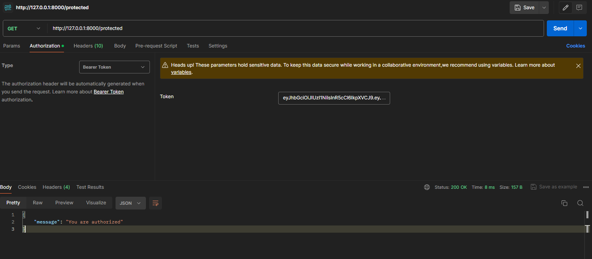
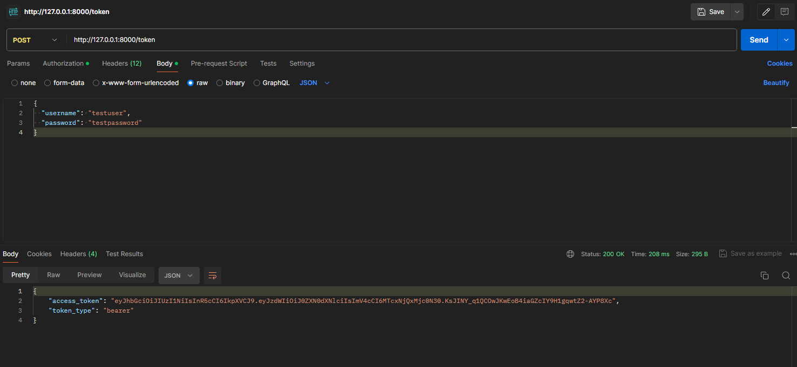

# FastAPI JWT Authentication Project

This project implements JWT authentication using FastAPI. It includes the following features:
- User login with JWT token generation
- JWT token validation
- Protected endpoints accessible only with a valid JWT token

## Prerequisites

- Python 3.7+
- `pip` package manager
- Docker
- Docker Compose

## Project Screenshots




...

## Project Structure

```
fastapi_jwt_project/
├── app/
│   ├── main.py
│   ├── auth.py
│   ├── middleware.py
│   ├── config.py
│   ├── user_data.txt
│   └── config.ini
├── Dockerfile
├── docker-compose.yml
├── requirements.txt
└── venv/
```

## Installation

### Clone the Repository

Clone the repository to your local machine:
```bash
git clone https://github.com/dogukocaciftci/FastAPI-JWT-Project
cd fastapi-jwt-project
```

### Set Up a Virtual Environment

Create a virtual environment and activate it:

On macOS/Linux:
```bash
python3 -m venv venv
source venv/bin/activate
```

On Windows:
```bash
python -m venv venv
.\venv\Scripts\activate
```

### Install Required Packages

Install the required Python packages:
```bash
pip install -r requirements.txt
```

## Configuration

### Create Configuration Files

1. Create a `config.ini` file in the `app` directory with the following content:
   ```ini
   [jwt]
   timeout = 30
   ```

2. Create a `user_data.txt` file in the `app` directory with hashed user credentials. First, create a script to hash the password:

   Create a file `app/hash_passwords.py` with the following content:
   ```python
   from passlib.context import CryptContext

   # Create a password context with bcrypt hashing scheme
   pwd_context = CryptContext(schemes=["bcrypt"], deprecated="auto")

   # Function to hash passwords
   def get_password_hash(password):
       return pwd_context.hash(password)

   # Sample users to hash
   users = {
       "testuser": "testpassword"
   }

   # Hash passwords and print the result
   for username, password in users.items():
       hashed_password = get_password_hash(password)
       print(f"{username}:{hashed_password}")
   ```

   Run the script to generate hashed passwords:
   ```bash
   python app/hash_passwords.py
   ```

   Copy the output and paste it into `user_data.txt`:
   ```
   testuser:$2b$12$EdCLKwwTAJaCftEiHtRUw.gccyPH3N6JdBB7EuANOMl2MtmbbWQHq
   ```

## Running the Application

### Using Docker Compose

1. **Create a `Dockerfile` in the project root with the following content:**
   ```dockerfile
   # Use the official Python image
   FROM python:3.12-slim

   # Set the working directory
   WORKDIR /app

   # Copy the requirements file and install the dependencies
   COPY requirements.txt .
   RUN pip install --no-cache-dir -r requirements.txt

   # Copy the rest of the application code
   COPY . .

   # Command to run the application
   CMD ["uvicorn", "app.main:app", "--host", "0.0.0.0", "--port", "8000", "--reload"]
   ```

2. **Create a `docker-compose.yml` file in the project root with the following content:**
   ```yaml
   version: '3.8'

   services:
     web:
       build: .
       ports:
         - "8000:8000"
       volumes:
         - .:/app
       environment:
         - PYTHONUNBUFFERED=1
   ```

3. **Build and start the application using Docker Compose:**
   ```bash
   docker-compose up --build
   ```

4. **Open your browser and go to `http://localhost:8000/docs` to access the API documentation.**

### Using Uvicorn

1. **Start the FastAPI application:**
   ```bash
   uvicorn app.main:app --reload
   ```

2. **Open your browser and go to `http://127.0.0.1:8000/docs` to access the API documentation.**

## Testing

### Obtain a JWT Token

1. **Send a POST request to `/token` with the following JSON body:**
   ```json
   {
       "username": "testuser",
       "password": "testpassword"
   }
   ```

2. **The response will contain an `access_token` which you can use to access protected endpoints.**

### Access a Protected Endpoint

1. **Send a GET request to `/protected` with the `Authorization` header:**
   ```
   Authorization: Bearer <your_token>
   ```

2. **You should receive a response with the message:**
   ```json
   {
       "message": "You are authorized"
   }
   ```


## Contributing

Feel free to submit issues and enhancement requests.

